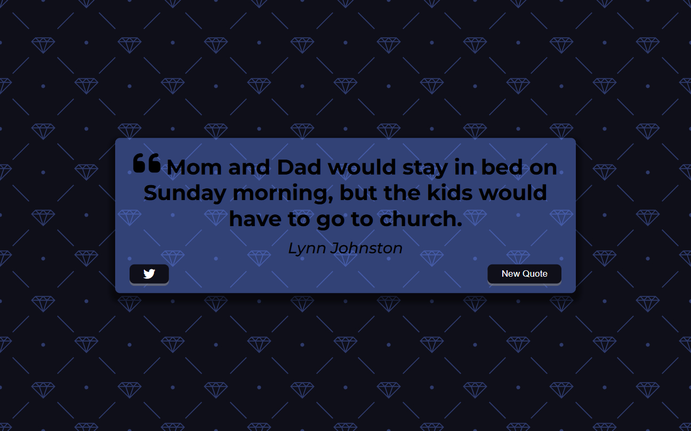

# Quote Generator | ZTM JS Web Projects Course

**Project 1/20**

A simple and aesthetic random quote generator that fetches quotes from an external API and displays them with a stylish UI. Users can view new quotes and tweet them directly.

---

## 📚 Table of Contents

- [🔎 Overview](#-overview)
  - [📸 Screenshot](#-screenshot)
  - [🔗 Links](#-links)
  - [📌 Features](#-features)
  - [🛠️ Built with](#️-built-with)
- [🧠 My process](#-my-process)
  - [🗃️ Useful resources](#️-useful-resources)
  - [🔜 Next Project](#-next-project)
- [👤 Author](#-author)
  - [🌐 Connect with Me](#-connect-with-me)
  - [💻 Coding Profiles](#-coding-profiles)

---

## 🔎 Overview

### 📸 Screenshot

### 🔗 Links

- [🔴 Live Demo](https://dalascript.github.io/quote-generator/)
- [🗂️ GitHub Repository](https://github.com/DalaScript/quote-generator)

### 📌 Features

- ✅ Random quote fetched from a public API
- ✅ Author name display (or "Unknown" if missing)
- ✅ Twitter share button
- ✅ Loader animation for smooth UX

### 🛠️ Built with

- HTML5
- CSS3
- Vanilla JavaScript
- Quote API

---

## 🧠 My Process

### 🗃️ Useful resources

- [Hero Patterns](https://heropatterns.com/)
- [Google Fonts](https://fonts.google.com/)
- [FontAwesome Icons](https://fontawesome.com/icons?d=gallery&q=close&m=free)
- [Twitter Integration Documentation](https://developer.x.com/en/docs/x-for-websites/tweet-button/guides/web-intent)
- [W3Schools - Loader](https://www.w3schools.com/howto/howto_css_loader.asp)
- [Random Quote API](https://forismatic.com/en/api/)
- [Fix CORS Error Article](https://medium.com/@dtkatz/3-ways-to-fix-the-cors-error-and-how-access-control-allow-origin-works-d97d55946d9)

### 🔜 Next Project

- Infinite Scroll | *Project 2/20* → [View Repository](https://github.com/DalaScript/infinity-scroll)

---

## 👤 Author

### 🌐 Connect with Me

- [Instagram](https://www.instagram.com/DalaScript)
- [YouTube](https://www.youtube.com/@DalaScript)

### 💻 Coding Profiles

- [freeCodeCamp](https://www.freecodecamp.org/DalaScript)
- [FrontendMentor](https://www.frontendmentor.io/profile/DalaScript)
- [GitHub](https://github.com/DalaScript)

*🙌 Thanks for checking out my project! More coming soon. Stay tuned 🚀*
